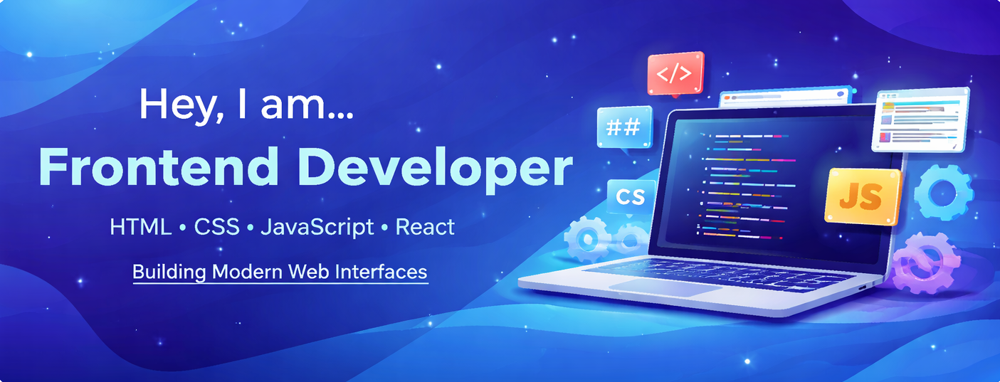

  

## About Me

Hi, I'm Hemanth Reddy, a frontend developer from India.

## My Skills

 
 
 
 

## GitHub Stats

<table><tbody><tr border="none"><td width="50%" align="center">
  
</td><td width="50%" align="center">
</td></tr></tbody></table>
