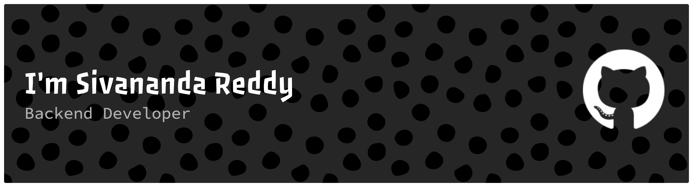

  

## About Me

Backend developer building reliable REST APIs, authentication systems, and payment workflows with Node.js, Express, TypeScript, and PostgreSQL — focused on clean API design, caching, and systems that scale.

## Projects

### eKart — Full-Stack E-Commerce Platform

Secure e-commerce app with JWT auth, Razorpay payments, admin dashboard, and Redis caching.

**Stack:** React, Node.js, Express, MongoDB, Redis, Razorpay

**[Explore eKart →](https://ekart-system.pages.dev)** — demo login included, one click to explore

### Mock API AI — AI-Powered Mock API Generator

Generate REST APIs from natural language using LLMs, with a live playground to test endpoints.

**Stack:** React, TypeScript, Express, PostgreSQL, Groq LLM

**[Explore Mock API AI →](https://mock-api-ai-system.pages.dev)** — no signup needed, try it instantly

## My Skills

### Languages

  

### Backend

  

### Frontend

 
<!--  -->

### Databases

  

### Tools and Devops

   

## GitHub Stats

<!-- <table>
  <tbody>
    <tr>
      <td width="50%" align="center">
          
        
      </td>
      <td width="50%" align="center">
        
      </td>
    </tr>
  </tbody>
</table> -->

<table width="100%">
  <tbody>
    <tr>
      <td width="50%" align="center" valign="top">
        
      </td>
      <td width="50%" align="center" valign="top">
        
      </td>
    </tr>
  </tbody>
</table>

<!-- ## Connect with Me

  
  

 -->

## Connect with Me

  <a href="https://www.linkedin.com/in/sivananda-reddy-yerragudi-630076337" target="_blank">LinkedIn</a> ·
  <a href="mailto:reddysivananda83@gmail.com" target="_blank">Email</a> · 
  <a href="https://resume-sable-eta-54.vercel.app/sivananda-reddy-resume.pdf" target="_blank">Resume</a> · 
  <a href="https://sivananda.is-a.dev/" target="_blank">Portfolio Site</a>

